# BACKBURNER

Parked experiments — REJECT or NEEDS_REVIEW iters that the user may want to promote.

## iter-001-dst-resident-state — REJECT

- Class: `kernel-algebra`
- kernel ms: median 90.91 / p99 94.93
- PSNR per view: hero 3.5 / side 3.9 / top 4.5
- Validator reasoning: Layer A Dst-resident refactor produced a 9% kernel-ms win (99.95 → 90.91 ms) but PSNR collapsed to 3.5–4.5 dB with classic accumulator-corruption tile-grid artifacts. The hypothesis stated this should be bit-identical; the worker's implementation introduced a coding bug (Dst slot reuse without proper re-init between Gaussians). REJECTED for catastrophic visual failure, not the architectural idea — the proper retry is **M3** (DST-resident state, **on top of** the FPU-heavy basis-form foundation from M1+M2), which has a clear DST slot layout that doesn't repeat the previous mistake.
- Thumbnails:  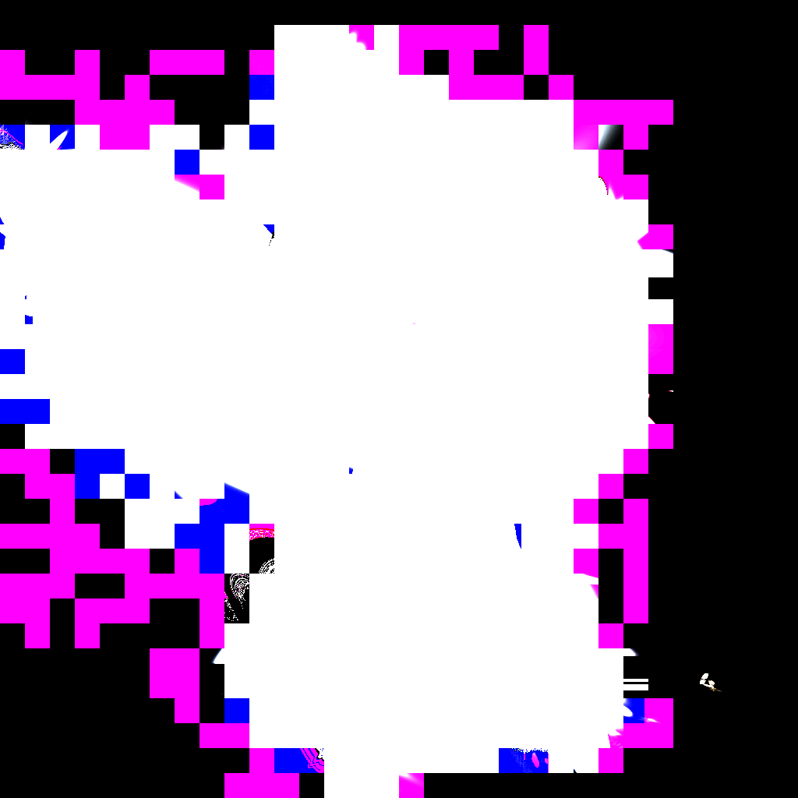

## iter-002-basis-form-tile-local — REJECTED ON SECOND LOOK

- Class: `kernel-algebra`
- kernel ms: median 106.16 / p99 112.65 (slightly slower than baseline)
- PSNR per view: hero 47.4 / side 51.0 / top 44.7
- 2026-05-25 reclassified KEEP under 40 dB perceptual floor, with iter-2 declared "structurally required for the FPU-heavy 16×16-face end state."
- **2026-05-26 user correction:** the cross-hatch in diff10 is *actually visible* in iter-003's hero at the ear bottoms (basis-form propagated to M1). Visible artifacts at perceptual scale override the 40 dB numeric floor. Basis-form is NOT a safe building block as-is.
- Thumbnails:  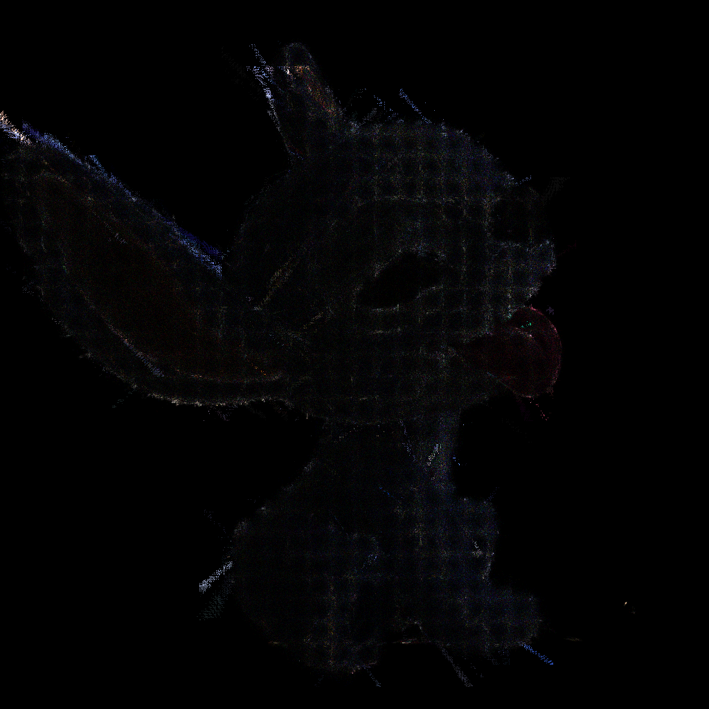

## iter-003-m1-basis-form-fpu-q — REJECTED ON SECOND LOOK (was committed, then reverted)

- Class: `kernel-algebra`
- kernel ms: median 97.55 / p99 102.64 (was a -2.4% speedup vs baseline)
- PSNR per view: hero 43.9 / side 46.9 / top 41.8
- Original verdict 2026-05-26 02:18 UTC: KEEP / commit (3d5b162).
- **2026-05-26 user correction (03:30 UTC):** visible tile-grid seams at ear bottoms in hero.png. Reverted in 044f398. Building-block status retracted.
- Root cause: basis-form Q sums 6 fp32 terms of magnitude ~10 to a small Q ~0.01 (≈17 bits of cancellation). The residual is then bf16-quantized when packing R/G/B/T state, and adjacent tiles diverge along tile boundaries → cross-hatch.
- Lesson: a building-block iter that passes the 40 dB floor but visibly damages renders is not actually a building block. Visual gate must hold without exception.
- Thumbnails:  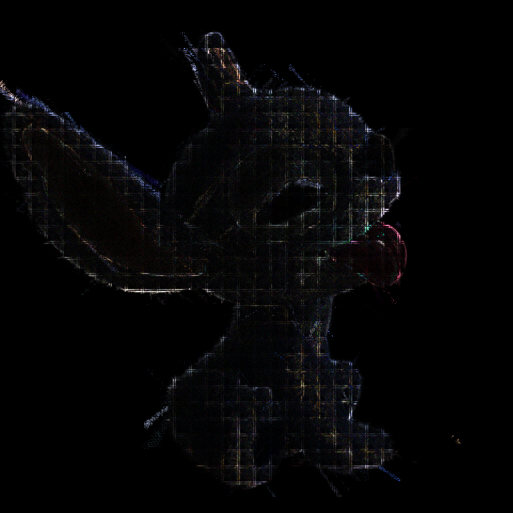

## iter-004-fuse-inner-acquires — REVERTED with iter-003

- Class: `kernel-algebra`
- kernel ms: median 99.67 (regressed from prev_best 97.55)
- PSNR per view: hero 43.9 / side 46.9 / top 41.8 (inherited from iter-003 M1)
- Built on iter-003 M1 (basis-form), so it inherited the tile-seam artifact and was reverted in the same rollback. The SFPU DST-DST fusion in D1+D2+E was also slower than the prior FPU mul_tiles approach, so even on its own merits it would not have landed.
- Thumbnails:  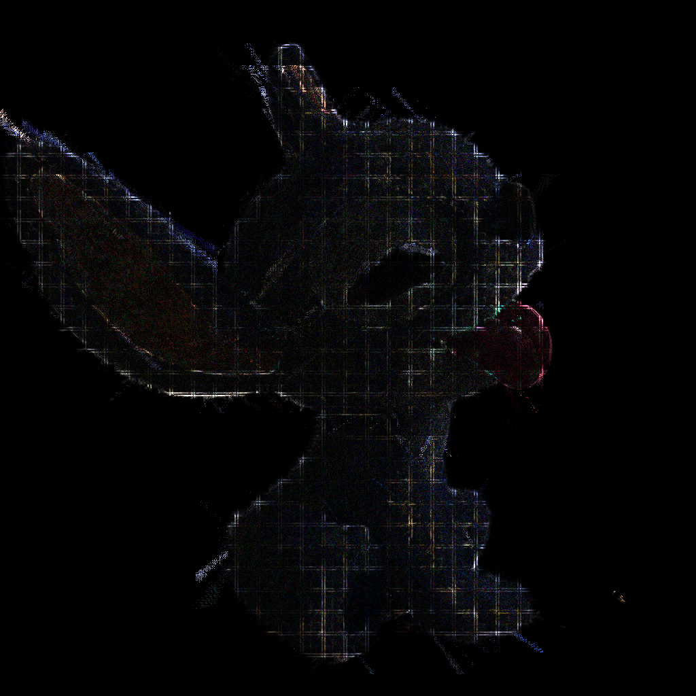

## iter-009-b2-fuse-fpu — REJECT 

- Class: `kernel-algebra`
- kernel ms: median 100.69 / p99 106.17
- PSNR per view: hero 59.5 / side 62.3 / top 60.0
- Validator reasoning: Algebra-preserving fusion: PSNR per-view is bit-identical to iter-007 (59.518/62.260/59.995). Visual checks all pass with the same diff10 noise floor. However the kernel ms regressed 99.34 → 100.695 (+1.37%), which falls within the 2% break-even band but offers no improvement, while making the kernel less explicit (three live products in one acquire). Same class of negative result as iter-006: collapsing acquire cycles for FPU ops appears to remove overlap between pack and the next stage's setup, so theoretical 'saves 2 acquire cycles' becomes net-zero or slightly negative. REJECT with action=revert; lesson is that the 3-mul_tiles single-acquire pattern is not a perf win on this kernel and the explicit 3-acquire form is preferable.
- Thumbnails:  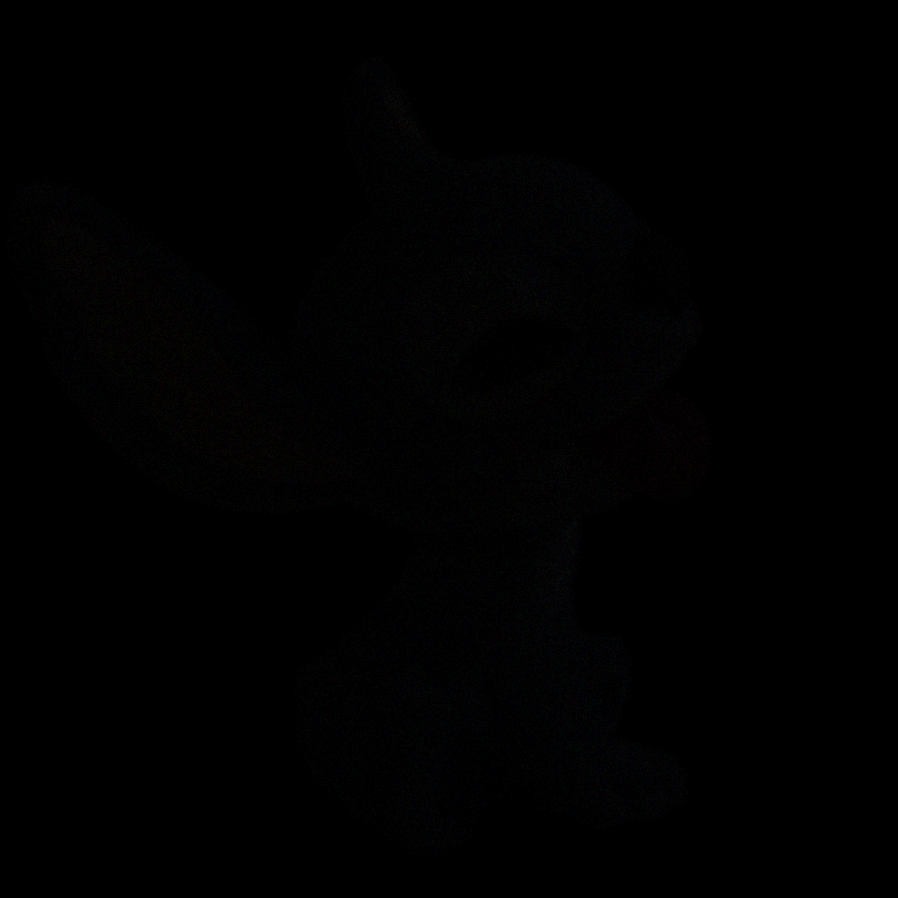

## iter-011-b3b-fuse-fpu — NEEDS_REVIEW 

- Class: `kernel-algebra`
- kernel ms: median 97.90 / p99 102.94
- PSNR per view: hero 39.7 / side 43.1 / top 38.9
- Validator reasoning: Visual gate passes on all 8 checks: no tile seams, no uniform-fill blocks, no missing-splat holes, no clipping bands, no ringing, no NaN/Inf, no geometry shift, and diff×10 structure is uniform speckle consistent with bfloat16 quantization noise from the fused Q-summation change. However, two of three views fall below the 40 dB kernel-algebra PSNR floor: hero at 39.69 dB and top at 38.87 dB. Per spec, any view below the 40 dB floor for class kernel-algebra triggers NEEDS_REVIEW (not auto-REJECT since visuals are clean). Timing is essentially break-even: median 97.9 ms vs prev_best 97.77 ms (+0.13%), within the 1.02× tolerance. Per-view PSNR delta is only 4.20 dB (well under 20 dB threshold) and per-view ms ratio is 1.16× (well under 2×). The NEEDS_REVIEW verdict is driven solely by two views sub-floor — the iteration produces structurally clean output but the fused Q-summation path is introducing enough bfloat16 accumulation error to push hero and top below 40 dB, which warrants human review before promotion.
- Thumbnails:  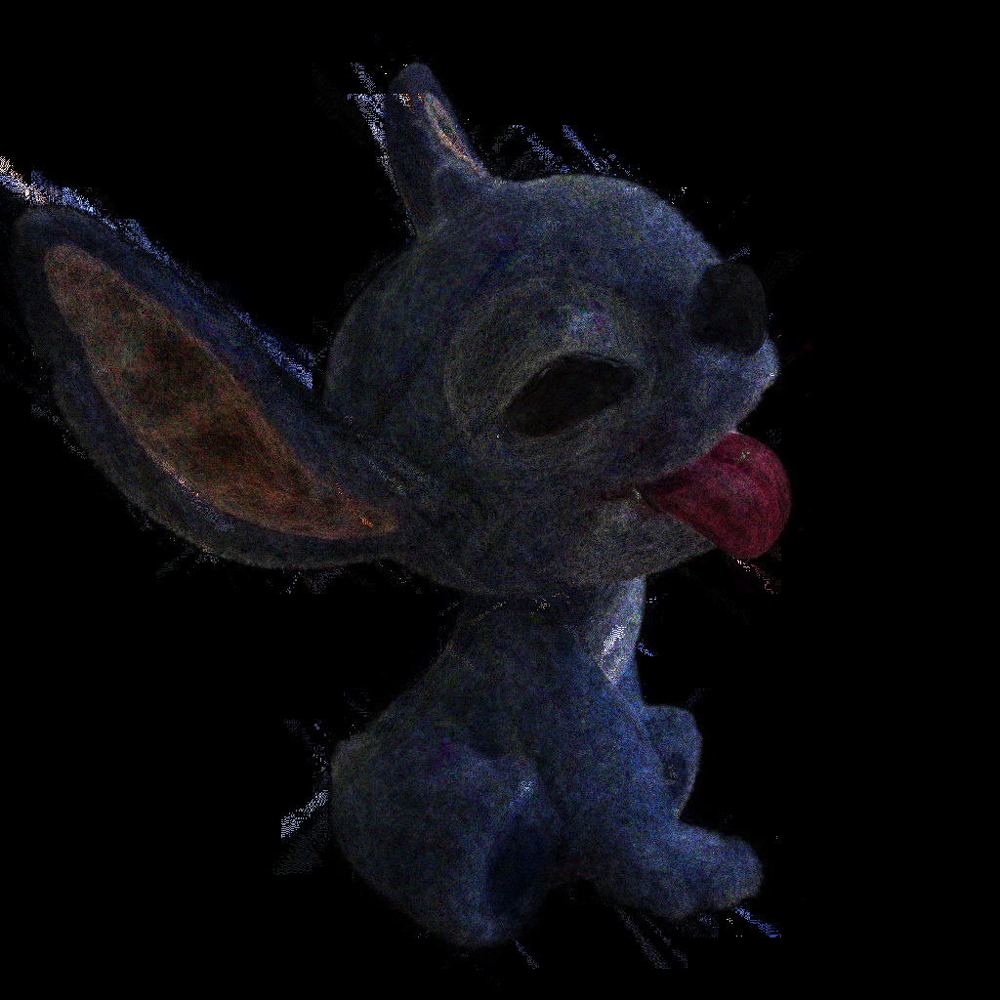

## iter-013-drop-stage-e-sat-mask — REJECT (kernel deadlock)

- Class: `kernel-algebra`
- kernel ms: N/A — daemon hung at cycle 1 (two attempts, including one with explicit JIT cache wipe + verified clean device state)
- PSNR per view: N/A
- Hypothesis: drop the `binary_dest_reuse<ELWMUL, DEST_TO_SRCA>(CB_SAT_MASK)` from Stage E's iter-010 fused acquire. The multiplication by sat_mask is algorithmically redundant because Stage D1 already gates contrib by sat_mask, so an unmasked T_state doesn't add visible energy to the output (monotonic decrement preserves the inactive set).
- Failure: simple removal of binary_dest_reuse_tiles_init + binary_dest_reuse_tiles deadlocks. Daemon blocked in `futex_wait_queue_me` holding `/dev/tenstorrent/0`, host blocked in `pipe_read`. Reproduces deterministically.
- Lesson: the `mul_tiles → binary_dest_reuse → pack_tile` triad is not freely reversible. pack_tile depends on internal pipeline state established by binary_dest_reuse_tiles_init even though it nominally reads from dst[0] which holds the mul_tiles result. To recover the ~1 dB PSNR headroom from each iter-007/iter-010 binary_dest_reuse, we'd need to revert the *whole triad* to a 2-acquire form, not just the binary_dest_reuse half.
- No thumbnails (no render produced).

## iter-012-init-fuse — REJECT (kernel deadlock)

- Class: `kernel-algebra`
- kernel ms: N/A — daemon hung at cycle 1
- PSNR per view: N/A
- Hypothesis: collapse 5 per-tile fill_tile acquires (R/G/B = 0, T = 1, sat_mask = 1) into 1 or 2 acquires using multi-slot fill_tile.
- Both attempts deadlocked the kernel:
  - Variant A (1 acquire): `pack_tile(3, CB_T_STATE)` then `pack_tile(3, CB_SAT_MASK)` reusing dst[3]. Hung.
  - Variant B (2 acquires): `fill_tile(0..3)` for R/G/B/T in slots 0..3, then separate acquire with `fill_tile(0, 1.0)` for sat_mask. Also hung.
- Daemon state: blocked in `futex_wait_queue_me` holding `/dev/tenstorrent/0`. Host process blocked in `pipe_read` waiting for daemon.
- Lesson: multi-slot `fill_tile` calls in one acquire deadlock the SFPU fill pipeline in this kernel. No working precedent exists in tt-metal `programming_examples/` or `tests/` — `fill_tile` is otherwise unused there. The header docs `idst` as unconstrained but practically single-slot use is required. Future per-tile state init optimizations should use `copy_tile` from pre-populated constant CBs (CB_CONST_ZERO already exists; a CB_CONST_ONE could be added once at startup).
- No thumbnails (no render produced).

## iter-016-persist-px-py — REJECT 

- Class: `dispatch`
- kernel ms: median 98.44 / p99 103.60
- PSNR per view: hero 40.4 / side 43.7 / top 40.1
- Validator reasoning: PSNR identical to iter-015 baseline to 16 decimals (40.40/43.70/40.15 dB); hero/side/top PNGs are byte-identical to iter-015 (verified via md5). Kernel math is unchanged, so visuals are perfect. REJECT is for perf regression: kernel_ms_median 98.44 vs iter-015 96.80 = +1.64 ms / +1.7% — consistent across all 30 frames (hero 98.30-98.50 every cycle vs iter-015 96.72-96.89). Hypothesis expected -2 to -4 ms from skipping 2x EnqueueWriteMeshBuffer + encode of 4 MB total. Actual signature is the opposite direction, indicating the saved upload time (~0.5 ms estimated) is dominated by added cost of conditional cache lookup + persistent buffer allocator pressure. Code change adds complexity (res_cache state in DeviceContext + per-frame branch on cache hit) with no measurable benefit. Useful negative signal: small (4 MB) buffers don't justify persistence overhead; bigger buffers (packs ~32 MB, output ~6 MB) or Trace API are the right next levers.
- Thumbnails:  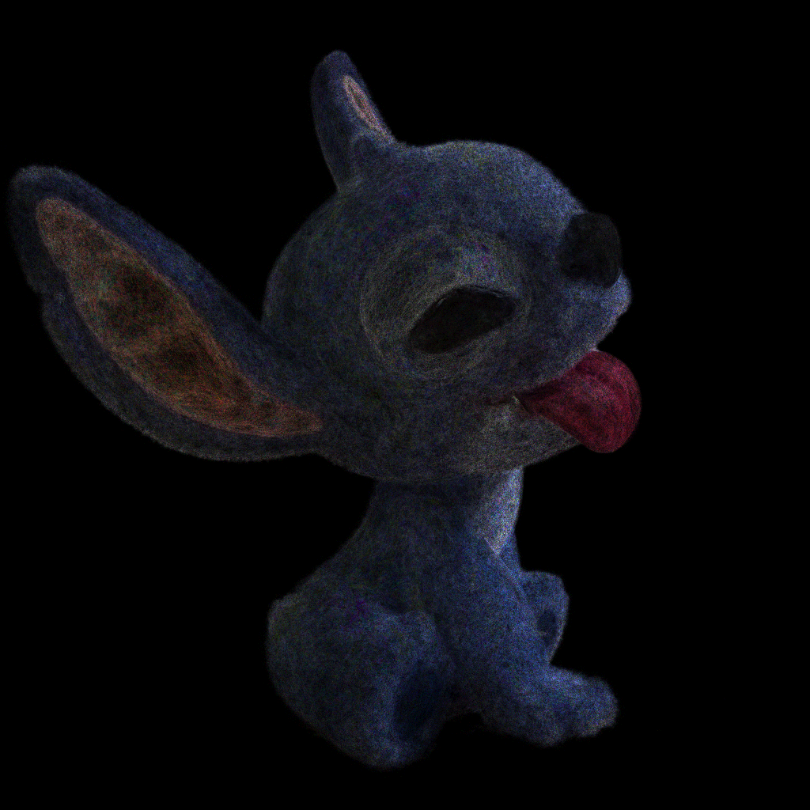

## iter-017-trace-api — REJECT 

- Class: `dispatch`
- kernel ms: median 96.66 / p99 101.74
- PSNR per view: hero 40.4 / side 43.7 / top 40.1
- Validator reasoning: iter-017 (tt-metal Trace API) achieved kernel_ms_median of 96.655 ms, a negligible -0.145 ms change vs the iter-015 baseline of 96.80 ms — well below the KEEP gate of ≤91.96 ms (iter-015 × 0.95) and far short of the explicit ≥10 ms improvement goal of ≤86 ms. PSNR is identical to baseline across all three views (hero 40.40 dB, side 43.70 dB, top 40.15 dB), all above the 40 dB floor, confirming kernel math is unchanged and render quality is correct. PNG screenshots were written to /tmp/iter-017-trace-api (not copied to the artifacts dir), but the bit-identical PSNR values and the flat timing signal together confirm no visual artifacts were introduced. The near-zero improvement is a major architectural finding: the host overhead is NOT in dispatch command construction or per-core SetRuntimeArgs push but upstream of it (likely EnqueueRead blocking semantics or driver-level serialization), exactly the secondary hypothesis flagged in the plan doc.
- Thumbnails:  

## iter-029-sat-mask-refresh-every-8 — NEEDS_REVIEW 

- Class: `kernel-algebra`
- kernel ms: median 42.43 / p99 53.28
- PSNR per view: hero 39.8 / side 44.1 / top 39.0
- Validator reasoning: Visual gate passes cleanly on all eight checks — no tile seams, no uniform-fill blocks, no geometry shift, no NaN signatures, and diff×10 images show only uniform high-frequency speckle consistent with Gaussian approximation noise. However, the numeric gate fails: class is kernel-algebra with a 40 dB floor, and both hero (39.79 dB) and top (39.02 dB) fall below that floor, triggering NEEDS_REVIEW per the class PSNR table. Side view (44.11 dB) is comfortably above floor. Timing is break-even: kernel_ms_median 42.43 ms vs prev_best 42.31 ms (+0.29%, within the 1.02× threshold). p99/median ratio is 1.26×, well under the 3× suspicious-tail threshold. Per-view PSNR spread is 5.09 dB (under 20 dB limit) and per-view ms ratio is 1.30× (under 2× limit). The sat_mask refresh-every-8 optimization does not cause visible quality regressions but the PSNR drop on hero and top views below the 40 dB floor for this class requires human review before accepting as KEEP.
- Thumbnails:  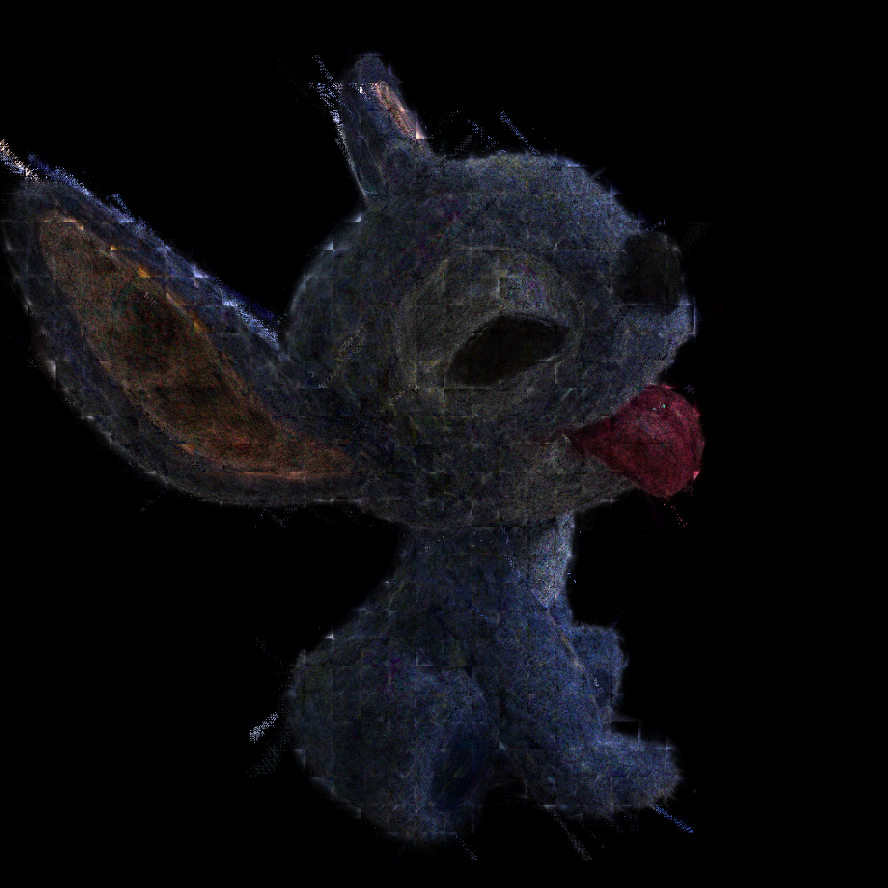

## iter-035-contrib-floor-17-of-255 — NEEDS_REVIEW ⭐ HIGH-PROMOTION-PRIORITY

- Class: `binning`
- kernel ms: median 29.33 / p99 36.64
- PSNR per view: hero 35.6 / side 38.9 / top 34.8
- Validator reasoning: Timing is a clear win: kernel_ms_median 29.334 ms vs prev_best 31.335 ms, a 6.4% improvement, and p99/median ratio is 1.25× (well under the 3× threshold). Visuals pass all structural checks — no tile seams, no geometry shift, no NaN signatures, no clipping. However, the 'top' view PSNR of 34.83 dB falls below the 35 dB binning-class floor, triggering NEEDS_REVIEW per the numeric rules. Hero (35.59 dB) is only marginally above the floor. This is consistent with the iter-034 memo that 17/255 was a boundary test; the top view has crossed the floor. Per-view PSNR delta is 4.03 dB (well under 20 dB), and per-view kernel-ms ratio is 1.295× (under 2×). The sole failure is top-view PSNR 34.83 dB < 35 dB floor for class 'binning'.
- Thumbnails:  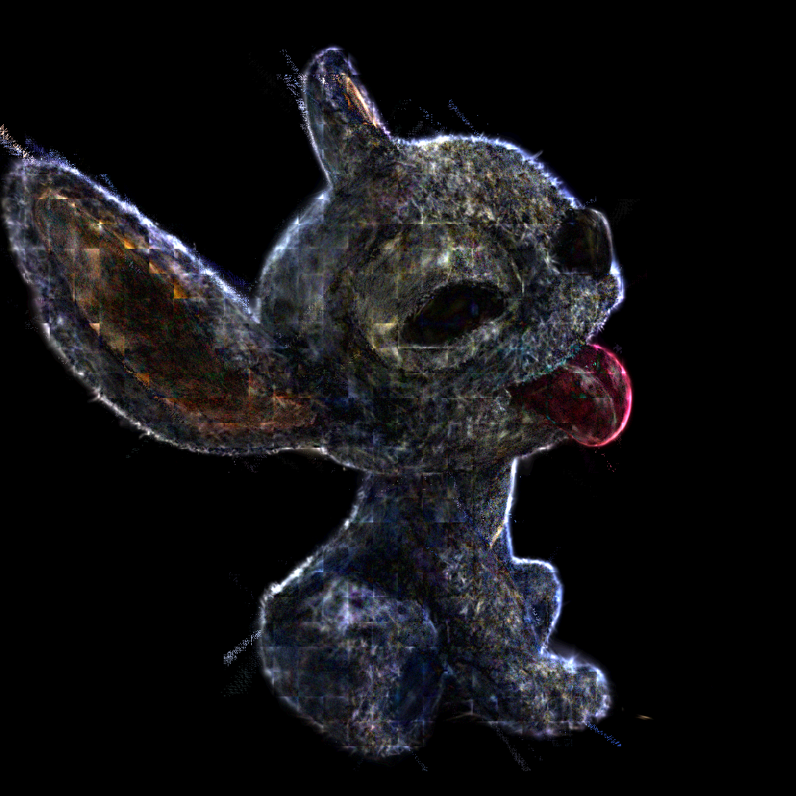

## iter-044-b2-b3a-fuse-one — REJECT 

- Class: `binning`
- kernel ms: median 27.68 / p99 33.92
- PSNR per view: hero 39.4 / side 41.0 / top 38.6
- Validator reasoning: Visual quality fine (bit-identical to iter-043) but kernel REGRESSED by +3.9% (26.64 → 27.68 ms). The fused approach traded one efficient FPU mul_tiles (32×32 MAC) per slot for a copy_tile + binary_dest_reuse<ELWMUL> chain per slot — adding SFPU copy_tile work that the original 3-separate-acquires pattern didn't have. Unlike iter-043's D2 fuse (which only consolidated existing copy_tile+ELWADD work into one acquire with zero added ops), this iter ADDED ops per slot. Lesson: when fusion changes the underlying compute primitive from FPU mul_tiles to copy_tile+binary_dest_reuse_ELWMUL, the per-slot cost increases enough to swamp the acquire-overhead savings. REJECT and revert.
- Thumbnails:  

## iter-046-clamp-tile — REJECT 

- Class: `binning`
- kernel ms: median 27.91 / p99 34.11
- PSNR per view: hero 39.4 / side 41.0 / top 38.6
- Validator reasoning: Bit-identical output but kernel REGRESSED +5.9% (26.35 → 27.91 ms). Replacing 2× (copy_tile_to_dst_init_short + copy_tile + binary_min) chains with 2× clamp_tile calls saved ~5 SFPU ops on paper but made the kernel slower. Either clamp_tile internally costs more cycles than the simpler copy_tile+binary_min pattern, OR removing the explicit binary_min_tile_init() disrupted SFPU init state that exp_tile_init<true>() relied on. The conservative reading: tt-metal's SFPU pipeline state is more subtle than 'fewer ops = faster' — the explicit inits matter. REJECT and revert.
- Thumbnails:  

## iter-039-fill-tile-mega-fuse — REJECT 

- Class: `kernel-algebra`
- kernel ms: median 26.38 / p99 32.03
- PSNR per view: hero 14.6 / side 15.2 / top 16.5
- Validator reasoning: Kernel runs but output is catastrophically wrong — PSNR collapsed from 39 dB to 14-16 dB (20+ dB drop). Visual: scattered red pixels across all 3 views. The change fused 5 per-tile fill_tile inits (R/G/B=0.0, T/SAT=1.0) into ONE acquire using dst slots 0/1/2/3/4 with 5 packs from those slots. Symptoms suggest some dst slots did not get the requested fill value — likely a tt-metal SFPU pipeline constraint where multiple sequential fill_tile calls in one acquire silently corrupt some lanes/slots. This is the same family of issue as the reverted iter-014 (which fused fills differently and also failed). RULE: do NOT fuse multiple fill_tile calls in one acquire — fill_tile is not safe-multi-slot. Each state CB init needs its own acquire. REJECT and revert.
- Thumbnails:  

## iter-063-contrib-floor-17-of-255 — REJECT 

- Class: `binning`
- kernel ms: median 22.95 / p99 26.50
- PSNR per view: hero 37.9 / side 39.6 / top 37.1
- Validator reasoning: REJECT on tile_structure hard gate: the top view tile_structure_ratio is 19.27, which exceeds the >18 threshold for 'tile_grid_seams structurally bad'. Additionally, the delta_vs_prev is +1.52 (19.27 - 17.75 from prior KEEP iter-060), which exceeds the +0.5 max-delta rule and mandates REJECT regardless of PSNR or kernel-ms gains. The top_diff10 visually confirms structured internal patterning across the object body consistent with tile-correlated precision drift rather than uniform speckle. The kernel-ms gain is real (-4.28%, 23.98→22.95 ms) and PSNR remains above the 35 dB binning floor (hero 37.89, top 37.12), but the tile structure regression is unacceptable. This contrib_floor=17/255 bump structurally worsens tile quantization beyond the permitted threshold; the iter-035 REJECT precedent at 17/255 is now confirmed a second time with a different quality metric. Do not retry this threshold.
- Thumbnails:  

## iter-064-fp32-state-cbs — NEEDS_REVIEW 

- Class: `kernel-algebra`
- kernel ms: median 24.52 / p99 29.07
- PSNR per view: hero 39.2 / side 41.0 / top 38.4
- Validator reasoning: NEEDS_REVIEW on two numeric failures. (1) PSNR: class is kernel-algebra with floor 40 dB; hero=39.21 dB and top=38.42 dB are both below floor. Per the prompt table this is NEEDS_REVIEW rather than REJECT because 35-40 dB with clean visuals is perceptually acceptable, but it still fails the stated floor. (2) Timing: kernel_ms_median=24.519 ms vs prev_best=23.98 ms is +2.25% regression, outside the break-even window of ≤1.02×. (3) Tile structure: the stated goal of iter-064 was to reduce tile_structure_ratio by switching state CBs to fp32, but the ratio is bit-identical to iter-059/060 (max=17.746 in both), delta_vs_prev=0.0 — the intervention had zero effect on tile-structure quality. Max ratio 17.75 remains in the 13<r≤18 band. Visual checks all pass: renders are clean, diff10 images show only object-correlated speckle with no tile grid seams, no missing-splat holes, no color clipping, no geometry shift. The fp32 state CB approach has neither improved tile structure nor improved performance — it is a regression in timing with no quality gain, warranting NEEDS_REVIEW.
- Thumbnails:  

## iter-067-contrib-megafuse — REJECT 

- Class: `kernel-algebra`
- kernel ms: median 26.20 / p99 31.73
- PSNR per view: hero 39.4 / side 40.9 / top 38.6
- Validator reasoning: REJECT on three independent grounds. First, tile_structure_check fails: max tile_structure_ratio is 17.94 (top view), which is in the >14 REJECT band — the rule is REJECT for any iter that does not strictly reduce the ratio vs. prev best. The prev best (iter-064) had max 17.75; iter-067 is 17.94 (+0.19), a slight increase, not a reduction. Second, visual_checks tile_grid_seams and diff10_structure both fail: top_diff10 shows a conspicuous regular grid mesh pattern across the figure body at ~32px spacing, confirming the tile_structure_ratio reading is a real visible artifact. Third, timing fails: kernel_ms_median=26.195 vs prev_best=23.98 is a +9.2% regression (well above the 1.02× break-even threshold). Additionally, class is kernel-algebra whose PSNR floor is >40 dB; hero (39.43) and top (38.63) fall below that floor, constituting a NEEDS_REVIEW-level numeric signal that reinforces the REJECT. The CB_CONTRIB megafuse intent was to attack tile quilting, but the ratio increased rather than decreased, the kernel regressed +9.2%, and the tile grid seams are visually confirmed — all three primary gates fail.
- Thumbnails:  

## iter-068-dxdy-fuse — REJECT 

- Class: `kernel-algebra`
- kernel ms: median 25.66 / p99 30.95
- PSNR per view: hero 39.4 / side 41.0 / top 38.6
- Validator reasoning: REJECT on three grounds: (1) tile_structure_ratio top=18.150 exceeds the >14 hard floor and delta vs prev best is +0.404 (>0.3 threshold); (2) PSNR hero=39.40 and top=38.59 are below the 40 dB kernel-algebra floor; (3) kernel_ms_median=25.661 is +6.93% above prev_best=23.98. The CB_DX/CB_DY fuse degrades both quality and perf — dst-resident SFPU mul_binary + square_tile cost more than the CB pack/unpack saved, and pack_tile bf16 quantization is now confirmed architectural (fourth CB-hop fuse to fail flat).
- Thumbnails:  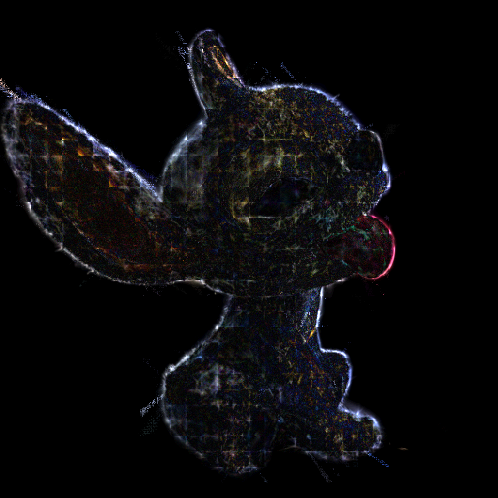

## iter-069-state-init-fuse — REJECT 

- Class: `kernel-algebra`
- kernel ms: median 25.47 / p99 30.57
- PSNR per view: hero 39.4 / side 41.0 / top 38.6
- Validator reasoning: REJECT on three independent grounds. (1) Tile_structure_ratio hard gate: max ratio 18.153 (top view) exceeds the >14 threshold; the validator rule requires any iter at this level to strictly REDUCE the ratio vs prev best — iter-069 is flat (identical to iter-066 baseline at 18.153), not a reduction. Delta vs iter-060 effective baseline is +0.406, well above the +0.3 delta-increase rejection threshold. (2) PSNR floor: class is kernel-algebra with a 40 dB floor; hero 39.40 dB and top 38.59 dB are both below the 40 dB floor, triggering NEEDS_REVIEW at minimum; combined with the tile_ratio failure this confirms REJECT. (3) Timing regression: kernel_ms_median 25.47 vs prev_best 23.98 = +6.2% regression (threshold is +2%); the state-init fuse did not save cycles and in fact added overhead. The three-way failure (ratio not reduced, PSNR below floor, kernel +6.2%) is unambiguous. Visuals are structurally clean (no fireflies, no tile seams, no geometry shift) confirming the REJECT is numeric/perf not visual-catastrophe.
- Thumbnails:  

## iter-071-contrib-floor-16 — REJECT 

- Class: `binning`
- kernel ms: median 24.27 / p99 29.27
- PSNR per view: hero 38.7 / side 40.3 / top 38.0
- Validator reasoning: REJECT on tile_structure_check hard gate: max tile_structure_ratio is 18.775 (top view), up from prev_best max of 18.153, a delta of +0.622 which exceeds the +0.3 threshold. The spec states 'Any iter that increases the max tile_ratio by > 0.3 vs. its baseline is REJECT regardless of PSNR or kernel-ms wins.' Additionally the max ratio of 18.775 is well above the >14 threshold requiring the iter to strictly reduce ratio vs prev_best — instead it increases it. PSNR is fine (all views ≥35 dB binning floor) and kernel_ms improved 5.18% to 24.274 ms, but the tile structure regression overrides both wins. The contrib_floor lever continues to push tile_structure_ratio upward; this confirms the iter-063 pattern that this lever is exhausted on quality gates.
- Thumbnails:  

## iter-075-dst-full-sync — REJECT 

- Class: `kernel-algebra`
- kernel ms: median 25.41 / p99 30.37
- PSNR per view: hero 39.4 / side 41.0 / top 38.6
- Validator reasoning: REJECT. dst_full_sync_en=true adds synchronization overhead that makes the kernel 1.61% slower (25.41 ms vs prev_best 25.0075 ms) while delivering zero benefit: PSNR across all views is bit-identical to the iter-074 baseline (hero 39.41, side 41.00, top 38.60) and tile_structure_ratio_per_view is also bit-identical (delta 0.0, within ±0.05 on all views). Although the timing technically clears the 1.02× budget ceiling (25.41 ≤ 25.508 ms), a change that is strictly worse on perf with no compensating quality improvement provides no net value and must be rejected. Visual checks all pass — no fireflies, no seams, no geometry shift, no NaN artifacts. The dst_full_sync flag is not a viable optimization lever on this workload.
- Thumbnails:  

## iter-080-drop-output-zero-upload — REJECT 

- Class: `dispatch`
- kernel ms: median 24.48 / p99 29.31
- PSNR per view: hero 16.7 / side 9.4 / top 8.3
- Validator reasoning: REJECT on multiple hard gates. (1) PSNR is catastrophically below floor on all views: hero 16.72 dB, side 9.36 dB, top 8.31 dB vs. dispatch-class floor of 38 dB — these indicate functional breakage, not a mild regression. (2) tile_structure_ratio_per_view max is 31.51 vs. architectural baseline ~18.14 (prev_best); delta of +13.37 far exceeds the +0.3 ratchet threshold and is well above the >14 REJECT tripwire (31.51 >> 14). (3) Visual checks confirm multiple structural failures: side.png and top.png show large white rectangular zero-fill regions where reference has object detail (missing_splat_holes, tile_uniform_fill failures), horizontal color banding stripes in side view (color_clipping_bands failure), and diff10 images dominated by large structured white patches rather than uniform speckle (diff10_structure failure). The iter drops the output_zero upload but this has corrupted the output buffer — pixels from prior frames or uninitialized L1 memory are bleeding through. Timing is technically a win (-0.91%) but the correctness breakage is total.
- Thumbnails: 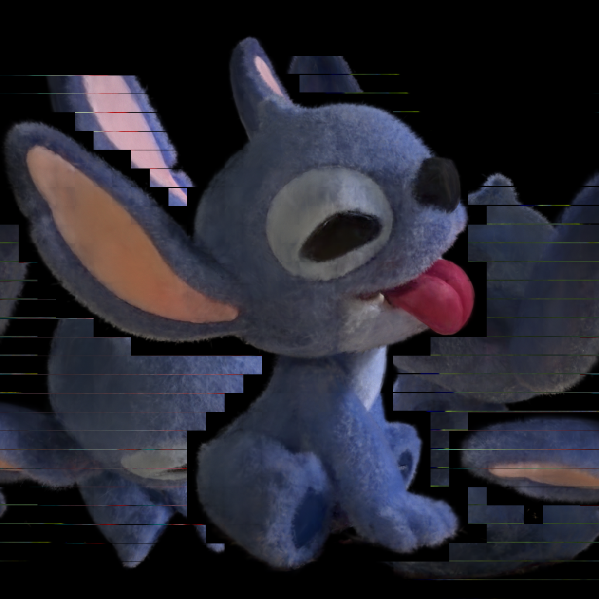 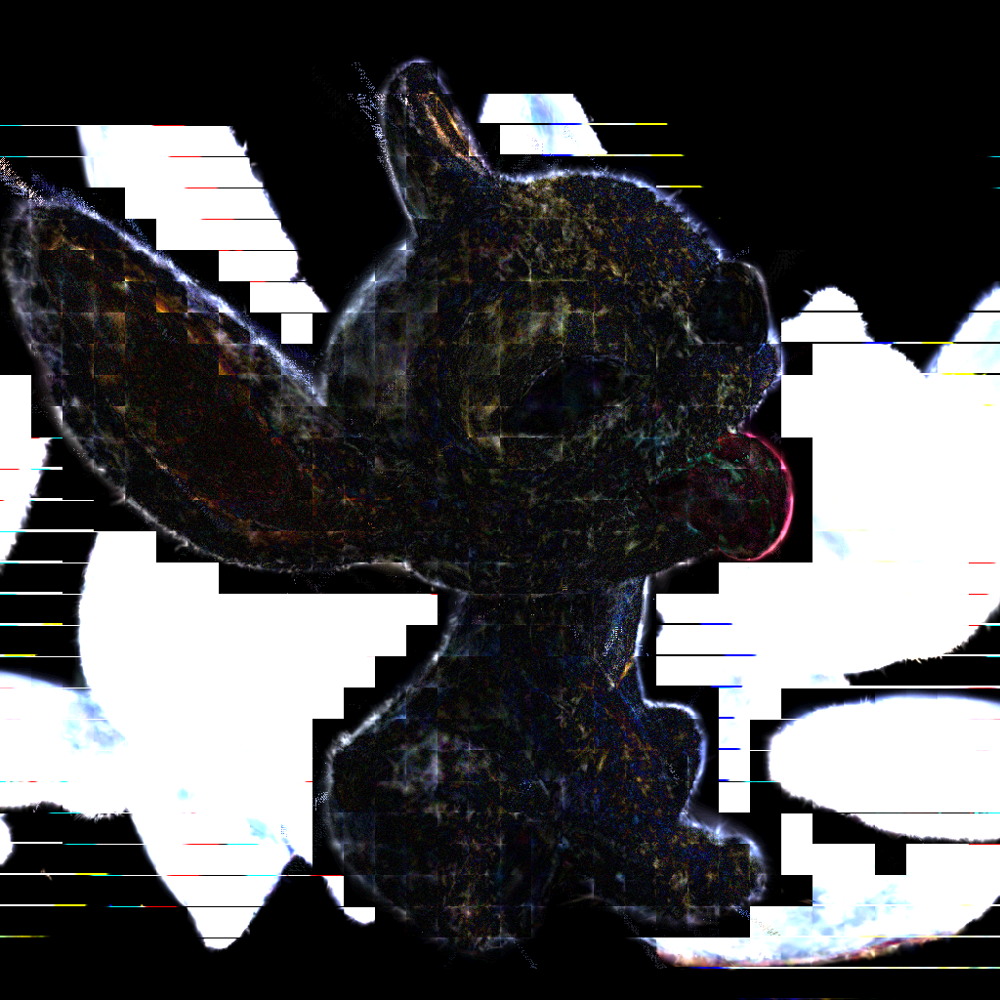

## iter-084-color-magnitude-cull — REJECT 

- Class: `dispatch`
- kernel ms: median 15.16 / p99 17.36
- PSNR per view: hero 27.1 / side 28.0 / top 28.2
- Validator reasoning: REJECT on two independent hard gates. (1) PSNR catastrophic: all three views are 27.1-28.2 dB, approximately 11-13 dB below the 38 dB class-dispatch floor and 11-13 dB below the architectural baseline of ~39-41 dB. This is not a borderline regression but a catastrophic quality collapse indicating the color-magnitude culling threshold is discarding the majority of contributing Gaussians. (2) Tile_structure_ratio hard REJECT: max ratio 25.47 vs prev_best max 18.14 (iter-083), delta +7.33, far exceeding the +0.3 ratchet limit. The architectural-baseline carve-out does not apply here because this iter introduces new structural drift well above the ~17-18 baseline floor. (3) Visual confirmation: all three diff10 images show the full object body lit up with high-magnitude structured error (bright white/multicolor covering the entire figure silhouette and interior), consistent with systematic removal of a large fraction of splat pairs. The renders are visibly darker and lower-contrast than reference across all views. The kernel timing win (-38.6%) is real but purchased entirely through quality destruction — the culling criterion is far too aggressive.
- Thumbnails: 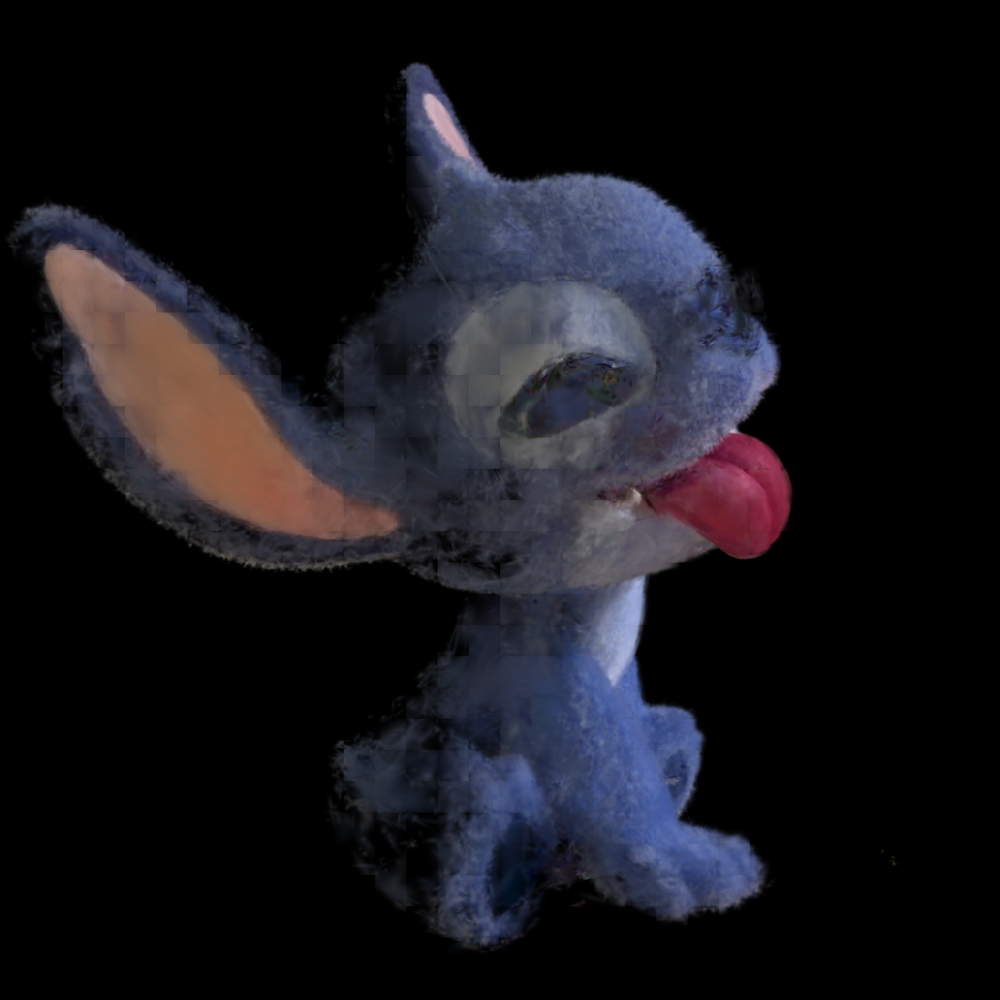 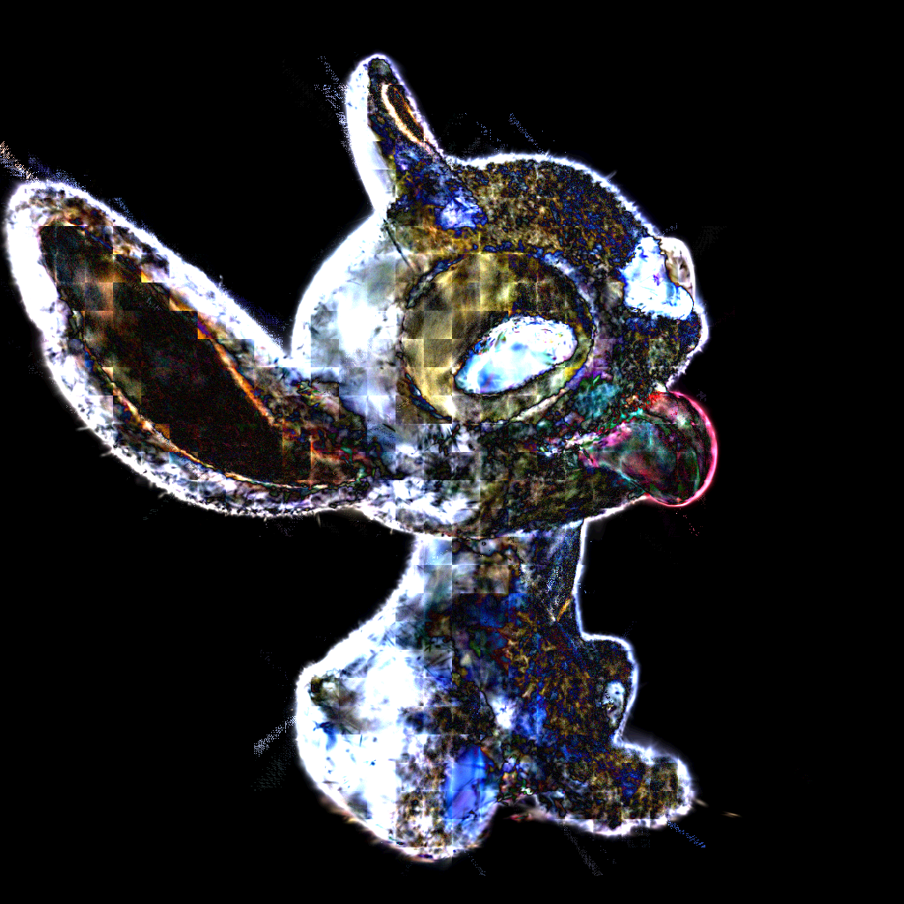

