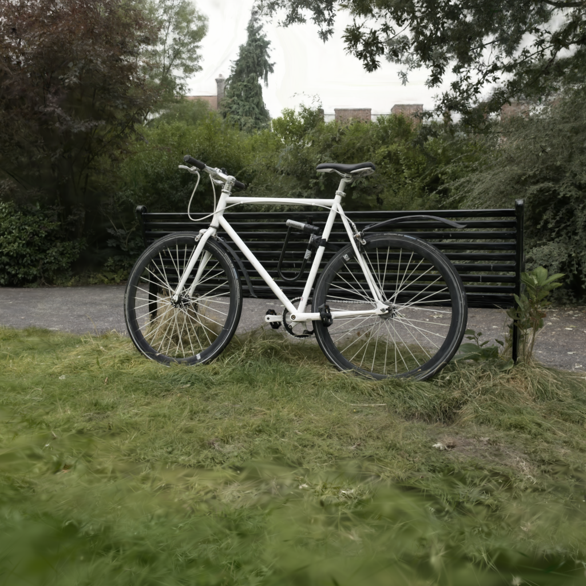

# CPU render comparison — Mac (NEON) vs x86 (AVX2)

Honest, apples-to-apples CPU render of the **same gstt2 HEAD source**, same
scene, same hero camera, same 30-view bench, run on two CPUs with **no
Tenstorrent device involved**. The TT row is a placeholder to be filled by the
supervisor.

- **Backend:** `cpu_cpp` (`backends/cpu_cpp/_gsplat_cpu`, gsplat
  `Pipeline.render`), built **CPU-only** with `-DGSPLAT_WITH_TT=OFF` so it does
  not require tt-metal or the device. It renders entirely on the host CPU.
- **Scene:** `scenes/bicycle.ply` (the bicycle point cloud, 6,131,954
  Gaussians), force-square **1024×1024**, fov 50°, `contrib_floor = 6.104e-05`.
- **Camera / bench:** the 30 views in `benchmarks/cameras_v2.json` (scene
  `bicycle`), in the file's `order` (hero first). Intrinsics via
  `_intrinsics_from_fov(W,H,fov)`, extrinsics via `c2w_to_w2c(c2w)` — the same
  convention as `gsplat.viewer` / `render/run.py`.
- **Bench identity:** identical `cameras_v2.json` on both machines
  (`md5 7c94b8c5…`), identical scene asset (`bicycle.ply`, 1,520,726,124 bytes
  on both), identical golden reference (`benchmarks/reference_v2/hero.png`).
- **Timing:** wall time per `pipeline.render` (project + tile_assign + sort +
  blend). All 30 views rendered in order; the **first (hero) view is the warmup
  and is excluded**; stats are over the remaining **29** views.
- **Hero PSNR:** hero render vs the project's golden 8-bit reference image
  `benchmarks/reference_v2/hero.png`, computed as `-10·log10(MSE)` on `[0,1]`.

## Results

| backend | machine | ISA / SIMD | build flags | avg_frame_ms (30v, warmup excl.) | p50 / min / max (ms) | hero PSNR | notes |
|---|---|---|---|---|---|---|---|
| `cpu_cpp` | Mac (this machine) — Apple M4 Pro, 14-core (10P+4E), 24 GB unified | ARM64 / **NEON** (128-bit) | `-DGSPLAT_WITH_TT=OFF` · Release `-O3 -march=native` · NEON auto-selected via `__ARM_NEON` (`simd_backend()=="neon"`) | **55.2** | 50.8 / 28.8 / 111.3 | **52.90 dB** | 29 timed views (hero warmup excluded). Built into `build-cpu-mac/`; `.so` → `backends/cpu_cpp/_gsplat_cpu.cpython-312-darwin.so`. |
| `cpu_cpp` | x86 — `yyzo-bh-07`, AMD Ryzen 5 7600X, 6c/12t (Zen 4) | x86-64 / **AVX2** (256-bit) | `-DGSPLAT_WITH_TT=OFF -DGSPLAT_SIMD_AVX2=ON` · Release `-O3 -march=native -mavx2 -mfma` (`simd_backend()=="avx2"`) | **149.0** | 133.4 / 104.8 / 308.6 | **52.90 dB** | 29 timed views. Built in a **fresh checkout** (`/localdev/smarton/gstt2-cpucmp`, Mac HEAD source rsynced) into `build-cpu-x86/`; the device viewer's `.so` was **not** clobbered. CPU-only, no device touched. |
| `tt` (Blackhole) | x86 host `yyzo-bh-07` + TT device | TT device kernels | `render/build-tt` (production `render_clean`, `GSPLAT_WITH_TT`) | _(filled by supervisor from iter-108 verify)_ | _(…)_ | _(…)_ — production anchor `hero_vs_ref ≈ 63.85 dB` is **TT vs the `cpu_cpp_mb` reference**, a different reference than the 8-bit golden PNG used in the CPU rows above | **Not run by this worker** — the device is owned exclusively by another worker; running a second device user risks a firmware wedge. |

Both CPU builds confirmed `has_tt_support() == False` (pure CPU, no device).

### Hero renders

| Mac (NEON) | x86 (AVX2) |
|---|---|
|  |  |

## Mac-NEON vs x86-AVX2 delta

The Apple **M4 Pro / NEON** build renders the 30-view bench at **55.2 ms/frame**,
about **2.7× faster** than the **Ryzen 5 7600X / AVX2** build at **149.0 ms/frame**
— even though AVX2 is twice the SIMD width of NEON (256-bit vs 128-bit). Three
machine factors dominate, and they outweigh SIMD width because the gsplat
forward pass (project → tile_assign → sort → microblock-cull → alpha-blend over
6.1 M Gaussians) is **thread-parallel and memory-bandwidth-bound**, not
SIMD-ALU-bound:

- **Core count.** The thread pool fans out across all hardware threads. The M4
  Pro offers **10 performance cores (+4 efficiency) = 14 threads**; the 7600X has
  only **6 cores / 12 SMT threads** (6 true cores). Roughly 1.7–2.3× more usable
  parallel throughput on the Mac before any per-core effects.
- **Memory bandwidth.** The blend/sort/gather stages stream scattered records
  for millions of Gaussians and accumulate per-pixel, so they saturate memory
  bandwidth. The M4 Pro's unified memory (~**273 GB/s**) is ~3–4× the 7600X's
  dual-channel DDR5 (~**70–83 GB/s**), which directly scales the bandwidth-bound
  stages in Apple's favor.
- **Per-core IPC / clocks.** M4 P-cores are very wide out-of-order designs at
  ~4.4–4.5 GHz; the 7600X boosts higher (~5.0–5.3 GHz) but its narrower core
  count and lower bandwidth cap aggregate throughput.

The wider AVX2 vector only accelerates the compute-bound inner math (the
`exp`/conic/alpha evaluation in `simd_exp_avx2.h`), which is **not** the
bottleneck here, so it cannot close the core-count + bandwidth gap. Notably the
**hero PSNR is identical to 3 decimals** on both (NEON 52.9022 dB, AVX2 52.9018
dB vs the same golden PNG), confirming the two SIMD paths are numerically
equivalent — the comparison differs only in speed, not in image. (The ~53 dB
ceiling is set largely by the 8-bit quantization of the golden reference PNG,
not by CPU error.)

## Reproduce

CPU-only build (per machine, into a separate build dir):

```bash
# Mac (NEON auto):
cmake -G Ninja -S src -B build-cpu-mac -DCMAKE_BUILD_TYPE=Release -DGSPLAT_WITH_TT=OFF
cmake --build build-cpu-mac --target _gsplat_cpu -j

# x86 (AVX2):
cmake -G Ninja -S src -B build-cpu-x86 -DCMAKE_BUILD_TYPE=Release -DGSPLAT_WITH_TT=OFF -DGSPLAT_SIMD_AVX2=ON
cmake --build build-cpu-x86 --target _gsplat_cpu -j
```

Render the bench headless (no device): `opt/cpu-vs-tt/render_cpu.py` (see its
`--help`). Raw per-view timings: `opt/cpu-vs-tt/{mac,x86}_result.json`.

## Build-enabling fix (compute-neutral)

gstt2 HEAD's `backends/cpu_cpp/pybind_module.cpp` did **not** compile with
`-DGSPLAT_WITH_TT=OFF`: in `render_full_py` the Tracy host-zone scopes for the
tile_assign and sort stages open their `{` **inside** `#ifdef GSPLAT_WITH_TT`
while the matching `}` sit **outside** it, and `gsplat_tt/host_tracy.hpp` (which
defines the no-op `GSPLAT_HOST_ZONE` / `GSPLAT_HOST_FRAME_MARK` macros) was only
`#include`d under the same guard. With TT off this left unbalanced braces and
undefined macros (the function body closed early). The minimal fix applied
(identical source on both machines):

1. `#include "gsplat_tt/host_tracy.hpp"` unconditionally — it self-guards on
   `TRACY_ENABLE` and expands to no-ops when Tracy is absent.
2. Move the two stage-scope `{` + `GSPLAT_HOST_ZONE(...)` lines **out** of
   `#ifdef GSPLAT_WITH_TT` so the block braces balance in both configurations.

This only changes conditional-compilation/structure; under `GSPLAT_WITH_TT` the
emitted code is unchanged, and the CPU compute path is untouched.

---

# GPU reference (CUDA 3DGS) — searched 2026-09-30, **not measurable here**

The charter's success criterion is "beat GPU performance", so this doc needs a
row for a CUDA 3DGS rasterizer (nerfstudio `gsplat` or graphdeco
`diff-gaussian-rasterization`) on the same bench: `scenes/bicycle.ply`, the same
30 `cameras_v2.json` views, 1024×1024. **No number is recorded below, because no
NVIDIA GPU is reachable from this environment.** Per the project restriction
("all performance numbers must come from real measurement"), nothing is
estimated, extrapolated from spec sheets, or quoted from papers.

## What was searched (2026-09-30)

| probe | result |
|---|---|
| `ird reserve --help` | the only reservable architectures are `grayskull`, `wormhole`, `wormhole_b0`, `blackhole`, `compute`. There is no GPU class to request. |
| `ird list-machines` (216 machines, clusters `tt_yyz`, `tt_aus`, `tt_sjc`, `tt_bgd`, `tt_blr`) | `ARCH` column is only `blackhole` (77), `wormhole_b0` (111), `compute` (28). No GPU arch exists in the inventory. |
| `lspci \| grep -ci nvidia` on every one of the 216 hostnames | 25 hosts answered ssh on bare metal (the other 191 only accept ssh inside an IRD reservation container). **All 25 report 0 NVIDIA PCI devices.** The `compute` machines (`yyzepyc12/13`, `yyzeon20`, `ausc-*`, `bgdepyc0*`) are CPU-only; the silicon hosts carry TT boards. |
| `nvidia-smi` on the reachable dev hosts (`yyz-ird`, `g15blx01`, `g15blx02`, `g14blx03`, `f07cs04`) | `command not found`; the only VGA device on each is an ASPEED BMC graphics controller. |
| local cloud-GPU escape hatches (`gcloud`, `aws`, `az`, `runpodctl`, `vastai`, `modal` + their credential dirs) | none installed, no credentials present. Renting a cloud GPU is a spend decision for the human, not something to do unilaterally. |

Conclusion: **a CUDA baseline cannot be produced from inside this project's
current resource set.** Getting one needs a human to provide either a GPU host
(lab machine, workstation, or a colleague's box) or a cloud-GPU credential.

## The harness is committed and ready

`bench/gpu_reference/run_gpu_bench.py` (+ `README.md`) will produce the row in
one command the moment a CUDA host exists. It is a single dependency-light file
(torch + gsplat/diff-gaussian-rasterization + plyfile + pillow) that can be
copied onto any GPU box alongside `scenes/` and `benchmarks/`.

Bench identity is not assumed — it was verified against this repo on 2026-09-30:

* **Camera math bit-identical.** The script's `intrinsics_from_fov` and
  `c2w_to_viewmat` were diffed against `gsplat/viewer.py::_intrinsics_from_fov`
  and `gsplat/utils.py::c2w_to_w2c`: max abs diff **0.0** on `K` and on all 30
  viewmats.
* **PLY activations bit-identical.** Both loaders were run over the full
  6,131,954-Gaussian `bicycle.ply`: `means`, `quats`, `scales`, `colors` max abs
  diff **0.0**; `opacities` 1 ULP (1.19e-07) from the numpy-vs-tensor `sigmoid`
  path.
* **Colors, not SH.** Colors are handed to the GPU rasterizer as precomputed RGB
  with `sh_degree=None`, so it renders the SH-degree-0 image our pipeline
  renders rather than evaluating the ply's higher bands.
* **Same warmup and timing rules as the CPU rows above**: hero view is warmup
  and excluded (29 timed views); CUDA-synchronised wall time around the
  rasterization call only; hero PSNR by the same `-10·log10(MSE)` against the
  same `benchmarks/reference_v2/hero.png`.
* The script **exits non-zero if no CUDA device is visible** instead of falling
  back to CPU, so it cannot produce a mislabelled number.

Running it writes `opt/cpu-vs-tt/gpu_result.json`; `opt/build_report.py` then
renders the GPU row (and the TT-vs-GPU ratio) into `opt/REPORT.html`
automatically.

## The TT side of the eventual ratio

For whoever runs the GPU box: the TT anchor to divide against is the frozen
plateau from `opt/FINAL-REPORT.md` — **173.3 ms/view avg** over the same 30-view
1024×1024 bicycle bench (iter-141, bit-identical to the 8-bit golden), measured
on a **Blackhole P100** in `yyzo-bh-07`. That is ~5.8 FPS. Note the charter
targets a **p150**; the frozen number is a P100, so a p150 re-measure should
accompany the GPU row.
